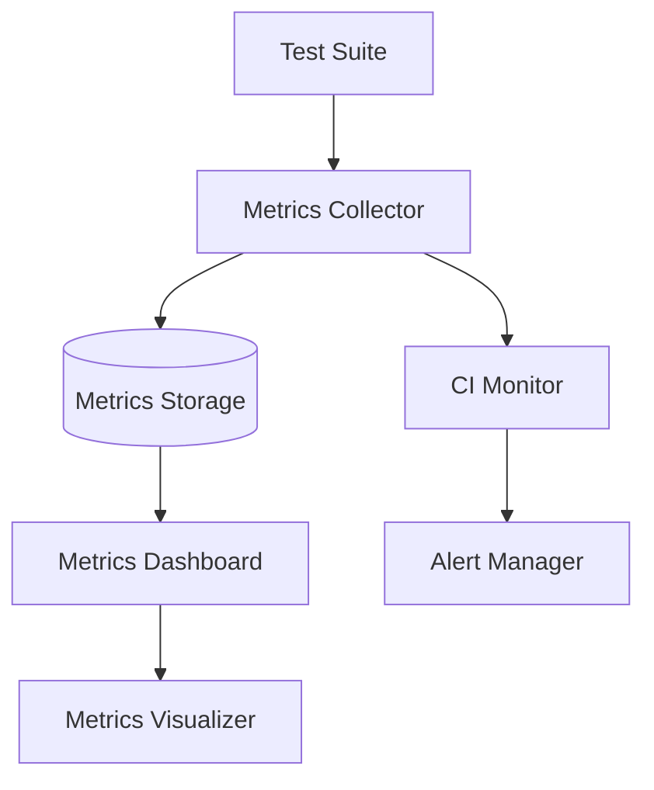
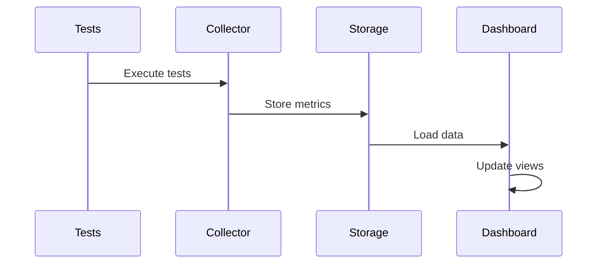
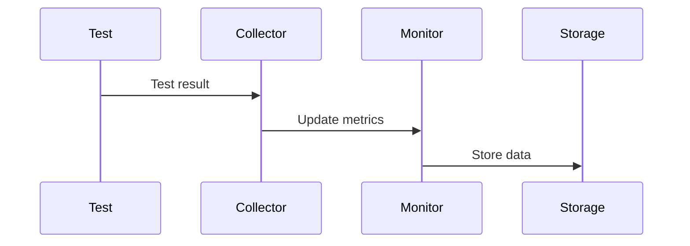

# Test Automation Monitoring System - Architecture

## System Overview



## Core Components

### 1. Metrics Collector (`metrics_collector.py`)
- **Purpose**: Collects and processes test execution metrics
- **Key Features**:
  - Real-time metric collection
  - Data aggregation
  - Statistical analysis
  - Error handling
- **Data Flow**:
  - Captures test results
  - Processes performance data
  - Stores metrics in JSON format
  - Handles metric calculations

### 2. CI Monitor (`ci_monitor.py`)
- **Purpose**: Monitors continuous integration metrics
- **Components**:
  - Prometheus metrics setup
  - Test execution tracking
  - Resource monitoring
  - Alert triggering
- **Integration**:
  - Prometheus client
  - Custom metrics registry
  - Alert manager interface

### 3. Metrics Dashboard (`metrics_dashboard.py`)
- **Purpose**: Visualizes test metrics and trends
- **Architecture**:
  - Dash application server
  - Real-time updates
  - Interactive visualizations
  - Configurable layouts
- **Features**:
  - Performance graphs
  - Quality gauges
  - Test result charts
  - Trend analysis

### 4. Metrics Visualizer (`metrics_visualizer.py`)
- **Purpose**: Creates data visualizations
- **Components**:
  - Graph generation
  - Chart configuration
  - Color schemes
  - Layout management

## Data Flow

### 1. Test Execution


### 2. Metric Collection


## Storage Architecture

### 1. Directory Structure
```
sample_analysis_results/
├── test_results_YYYYMMDD/
│   ├── metrics/
│   │   ├── metrics_YYYYMMDD_HHMMSS.json
│   │   └── metrics.log
│   ├── alerts/
│   └── visualizations/
```

### 2. Data Format
```json
{
  "timestamp": "ISO-8601",
  "performance": {
    "response_time": [],
    "throughput": [],
    "error_rate": []
  },
  "quality": {
    "completeness": 0.95,
    "consistency": 0.98,
    "validity": 0.92
  },
  "tests": {
    "passed": 95,
    "failed": 3,
    "skipped": 2
  },
  "system": {
    "cpu_usage": [],
    "memory_usage": []
  }
}
```

## Configuration Management

### 1. Dashboard Configuration
- Location: `workflows/yaml_workflows/dashboard_config.yml`
- Purpose: Controls dashboard appearance and behavior
- Components:
  - Layout settings
  - Panel configurations
  - Style definitions
  - Update intervals

### 2. Monitoring Configuration
- Location: `workflows/yaml_workflows/monitoring_config.yml`
- Purpose: Defines monitoring parameters
- Settings:
  - Alert thresholds
  - Metric definitions
  - Collection intervals
  - Resource limits

## Security Considerations

### 1. Data Protection
- Metrics stored in secure location
- Access control via file permissions
- No sensitive data in metrics
- Sanitized error messages

### 2. Network Security
- Local-only dashboard access
- No external dependencies
- Configurable ports
- Secure data transmission

## Scalability

### 1. Horizontal Scaling
- Independent component deployment
- Distributed metric collection
- Separate storage options
- Load balancing ready

### 2. Performance Optimization
- Efficient data storage
- Optimized queries
- Caching mechanisms
- Resource management

## Error Handling

### 1. Fault Tolerance
- Graceful degradation
- Default fallbacks
- Error recovery
- Data validation

### 2. Logging
- Centralized logging
- Error tracking
- Performance monitoring
- Audit trail

## Future Enhancements

### 1. Planned Features
- Machine learning analysis
- Predictive alerts
- Custom metric plugins
- Advanced visualizations

### 2. Integration Points
- CI/CD pipeline hooks
- External monitoring
- Alert aggregation
- Report generation
